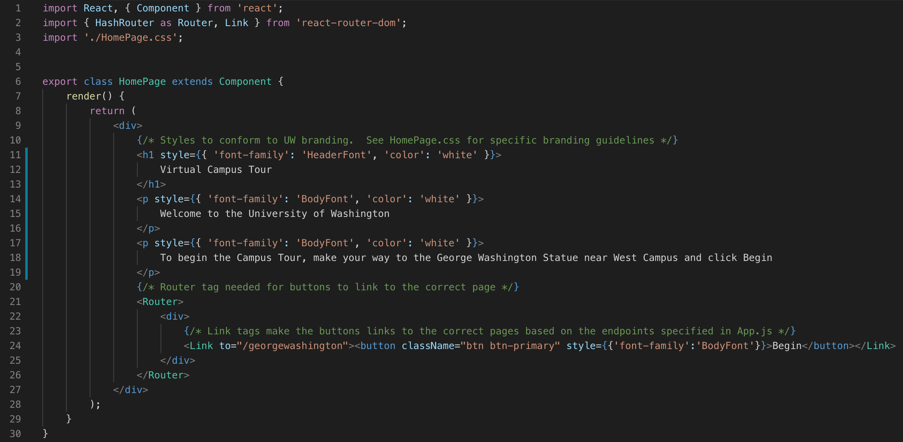
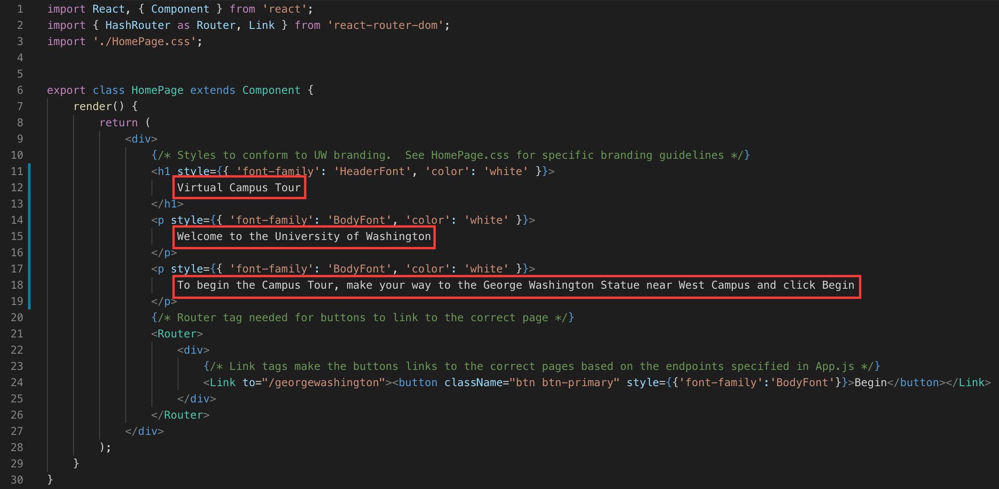
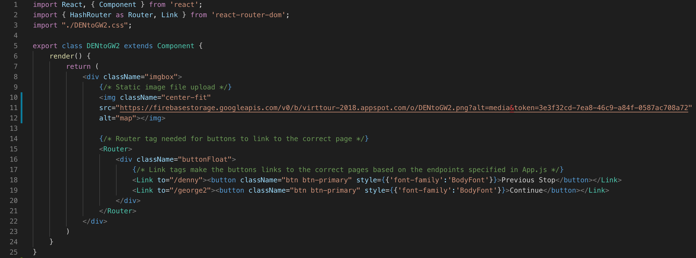
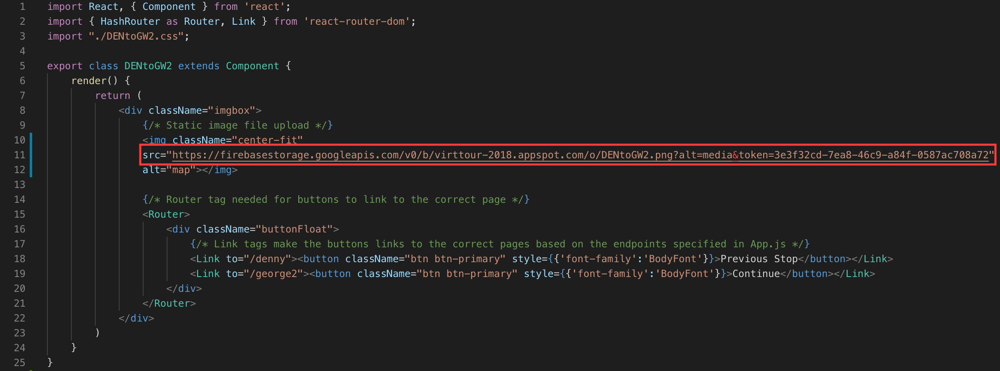
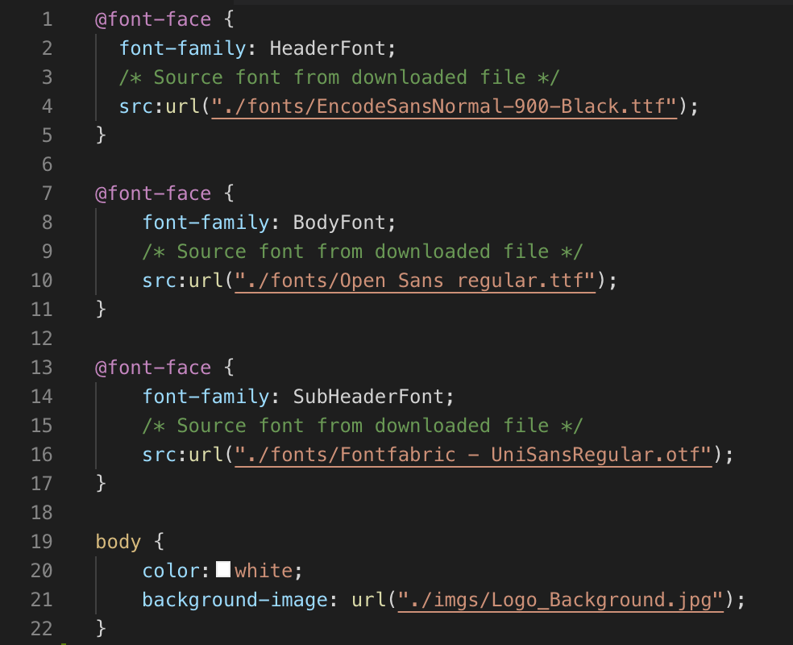
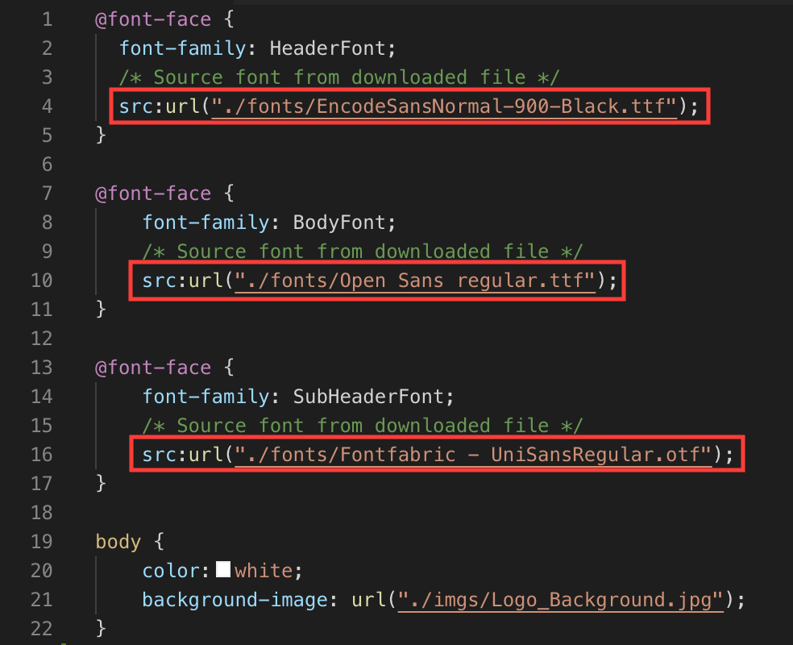

# Table of Contents
1. [General Information](https://github.com/Kyle-Simpson/virttour#general-information)  
2. [Technical Documentation](https://github.com/Kyle-Simpson/virttour#technical-documentation)  
  2.1. [Javascript and HTML](https://github.com/Kyle-Simpson/virttour#javascript-and-html)  
  &nbsp;&nbsp; 2.1.1. [Logical Flow Through JS Files](https://github.com/Kyle-Simpson/virttour#logical-flow-through-js-files)  
  2.2. [CSS](https://github.com/Kyle-Simpson/virttour#css)  
  2.3. [Maintenance & Updates](https://github.com/Kyle-Simpson/virttour#maintenance-and-updates-for-admissions-staff)  
  &nbsp;&nbsp; 2.3.1. [Common Changes](https://github.com/Kyle-Simpson/virttour#common-changes--how-to-make-them)  
  &nbsp;&nbsp;&nbsp;&nbsp; 2.3.1.1. [Changing Wording](https://github.com/Kyle-Simpson/virttour#1-changing-wording-of-a-webpage)  
  &nbsp;&nbsp;&nbsp;&nbsp; 2.3.1.2. [Changing Map Image](https://github.com/Kyle-Simpson/virttour#2-updating-a-map-image)  
  &nbsp;&nbsp;&nbsp;&nbsp; 2.3.1.3. [Changing Font or Branding](https://github.com/Kyle-Simpson/virttour#3-changing-branding-or-font)  
  2.4. [Potential Future Features](https://github.com/Kyle-Simpson/virttour#potential-future-features)  
3. [Notes from the Author](https://github.com/Kyle-Simpson/virttour#notes-from-the-author)  

# General Information
This website was created by request of Tamara Long to replace the old Guidebook application that previously hosted UW's virtual campus tour.

This website, created by Kyle Simpson (a UW Informatics student and one of the 2018-2019 Student Directors of the Office of Admissions' Campus Visit Program), takes visitors around the University of Washington's Seattle campus to see the highlights of campus.  

The tour is narrated by two former tour guides, with quotes from various guests.  

# Technical Documentation
## Javascript and HTML
In test, the website was built using React, React Router, and Firebase.  Firebase is/will be phased out when the application is transitioned onto the Admissions server.  The application was developed using mobile-first design principles and is optimized for smaller screen sizes.

The .js files are relatively flat and are relatively technically simple.  There are 3 types of .js files found
1. Introduction & Conclusion pages that bookend the application
    - HomePage.js
    - Fin.js
2. Audio content pages that present the tour
    - Den.js (Denny Hall) (fully documented)
    - Drum.js (Drumheller Fountain)
    - GW.js (George Washington Statue [the first time])
    - GW2.js (George Washington Statue [the second time])
    - Hub.js (Husky Union Building)
    - MGH.js (Mary Gates Hall)
    - Quad.js (Liberal Arts Quadrangle)
    - RS.js (Red Square)
    - RV.js (Rainier Vista)
    - Suzz.js (Suzzalo Library)
    - WC.js (West Campus)
    - Wet.js (Wǝɫǝbʔaltxʷ)
3. Connecting pages that display maps
    - DENtoGW2.js (Denny Hall to George Washington Statue [the second time]) (fully documented)
    - DRUMtoRV.js (Drumheller Fountain to Rainier Vista)
    - GW2toWC.js (George Washington [the second time] to West Campus)
    - GWtoRS.js (George Washington Statue [the first time] to Red Square)
    - HUBtoWET.js (Husky Union Building to Wǝɫǝbʔaltxʷ)
    - MGHtoDRUM.js (Mary Gates Hall to Drumheller Fountain)
    - QUADtoDEN.js (Liberal Arts Quadrangle to Denny Hall)
    - RStoSUZZ.js (Red Square to Suzzalo Library)
    - RVtoHUB.js (Rainier Vista to Husky Union Building)
    - SUZZtoMGH.js (Suzzalo Library to Mary Gates Hall)
    - WETtoQUAD.js (Wǝɫǝbʔaltxʷ to Liberal Arts Quadrangle)

The App.js file sets the endpoints and initializes the webpage instance.

The intro and conclusion pages have been fully documented, and one of each of the content and connection pages have been fully documented.  Each other .js file is identical to those with similar purposes (except for slightly different source urls).

### Logical Flow Through JS Files
Since the JS files are so flat it is easy to trace the path through the files.  This section will map the connection between each file (assuming linear navigation through the application).

HomePage.js -> GW.js -> GWtoRS.js -> RS.js -> RStoSUZZ.js -> SUZZ.js -> SUZZtoMGH.js -> MGH.js -> MGHtoDRUM.js -> DRUM.js -> DRUMtoRV.js -> RV.js -> RVtoHUB.js -> HUB.js -> HUBtoWET.js -> WET.js -> WETtoQUAD.js -> QUAD.js -> QUADtoDEN.js -> DEN.js -> DENtoGW2.js -> GW2.jsGW2toWC.js -> WC.js -> FIN.js

## CSS
The primary function of .css files in this application is to load the maps.  Each stop-connector component has its own .css file that almost exclusively serves to place the map images and reposition the buttons at the bottom of the window.  CSS is used minimally throughout the application since there are so many variants of mobile screen sizes, so a certain degree of imperfection is expected on some pages depending on the screen size of the viewing device.

## Maintenance and Updates (for Admissions Staff)
To perform maintenance on the website, you will need a few things:
1. A code editor of your choice (Visual Studio Code, Atom, Sublime, etc.)
2. Internet access
3. Administrator privileges on the computer you're using
4. NPM (https://www.npmjs.com/get-npm)

The instructions below will work whether you're using OS X (Mac) or Windows.  Be sure to follow the commands strictly as there are certain syntax necessities that will cause the command to fail if not input exactly.

1. Open the Terminal.
2. Change directory into the desktop `cd Desktop`.
3. Clone the repo `git clone https://github.com/Kyle-Simpson/virttour.git`.
4. Change directory into the folder we just made `cd virttour`.
5. Open your code editor and open the file you wish to change.
6. Make the changes you wish to make and save the file.

<!-- What is below may not be correct since the team may want a tar or zip file of the application.  We may just be able to make the change and then zip the folder.  We may also have to deploy first so we have the gh-pages version of the website, and then sip the folder. -->

7. Return to the terminal and type `npm run build`.
  - Note: we are using GitHub Pages to host some of the code.  The command `build` is specified in the package.json file and tells npm to compile all of the files.
8. Type `npm run deploy`.
  - Note: this is partially redundant since we have specified that the `deploy` command will build the project as well.  
Our changes have now been built and deployed, now we just need to push our changes back up to GitHub.
9. Still in the terminal, type `git add .` (don't forget the period!).
10. Then type `git commit -m "Maintenance changes"`.
  - Note: there may be an issue asking you to identify yourself as an author of the changes.  If so, follow the instructions given, then redo this step.
11. Finally, `git push origin master`.

We have now successfully rebuilt the application.  Now that the changes are fixed, contact the web team to have them put the new version of the website onto the Admissions server.

### Common Changes & How to Make Them
I anticipate that the most common change would be to the wording of a page in the application, updating one of the map images, or changing the branding/font.  For each of these three cases, I will provide exact replication steps of how to make the changes in the code.  If performing this maintenance, I will assume that you have already completed steps 1-5 above.

#### 1. Changing Wording of a Webpage
We are going to use HomePage.js as our example file.  This is the first page a visitor sees when they reach the website.  Below is a screenshot of what the file will, more or less, look like.  

To change any of the text on the webpage, the only lines you will want to edit are boxed below in red.  

You can simply delete the text you want to replace and retype the new text.  Once you're done making edits, return to Step 7 of the maintenance instructions above to save and deploy your changes.  

#### 2. Updating a Map Image
This is the most challenging edit to make since you will first need to create the new image, send it to the web team to have them host the image (in order to get the URL for the image), and then make the change in the code.  This step will assume that you have already created the image, sent it to the web team, and received the new URL.

You will only need to make one change to the code to change the map image.  Below is a screenshot of what the file will, more or less, look like.

The only line you will need to alter is boxed in red below.

Simply replace the text that is inside the double quotes with the URL the web team sent.  Once you're done making these edits, return to Step 7 of the maintenance instructions above to save and deploy your changes.

#### 3. Changing Branding or Font
If you ever want to change the font, there is only one file you will need to change that will change all of the font throughout the website.  The HomePage.css file holds all of the font definitions for the entire website, so making changes here will be sufficient to change all of the font (Note that this is a slightly different language than the HTML we worked with before).  Before we make changes to the code, you will need to download the font file.  If the font is a UW font, you can download the font file from their branding & assets website.  While you're here, make a note of the purpose of the font, whether it's for headers, sub-headers, or body text.  This distinction will be important later.

Once you have downloaded the font file, we will want to place it in a folder within the Virtual Tour "parent" folder.  
1. Open the `virttour` folder you downloaded.
2. Open the `src` folder under the `virttour` folder.
3. Open the `fonts` folder under the `src` folder.
4. Drag and drop the font file into this folder.  If there is a conflict with another file named the same thing, overwrite the old file.  
While you're here, make a note of the exact name of the font's file name INCLUDING any file extension it may have (ex. ttf, otf, ttc).  We will need this name later.

Now that we have the font we want to update, we can make the change in our code. Below is a screenshot of what the HomePage.css file will, more or less, look like.

You will see that there are 3 distinct mentions of `@font-face`.  Each of these establishes a different kind of font, and the font we are updating will determine which `@font-face` we will change.

IF we are changing the font of the headers (i.e. the "Virtual Campus Tour" text on the homepage, or the font of the stop name), we want to change the first `@font-face` that establishes the HeaderFont.

IF we are changing the font of the body (i.e. the normal text below the header on the Homepage, or any of the buttons), we want to change the second `@font-face` that establishes the BodyFont.

IF we are changing the font of the sub-headers (which are not currently utilized in the application), we want to change the third `@font-face` that establishes the SubHeaderFont.

Now that we know which we want to change, you will need to make one very basic edit to one of the lines boxed below.

Again, you will only want to change one of these lines, so only change the line of the `@font-face` you want to update.

Now is when the EXACT font file name is important.  On the line you want to change, delete what is inside the double quotes, and replace it with `./fonts/INSERT-EXACT-FILENAME-HERE`.  You will not need to add dashes between the words in the file name like I did in this example, and be sure to keep the double quotes.

Recap:
We first downloaded the font file.  Then, we moved the font file within the `fonts` folder that is nested within the `virttour` folder.  Next, we identified the line of code we wanted to change by remembering the use of the font we downloaded (header, sub-header, or body).  Then, we made the change and saved the file.  Now that we saved the file, we can return to Step 7 of the maintenance instructions above to save and deploy your changes.

## Potential Future Features
As a full-time student, there are some features that I do not have the time to implement.  These features and edits would add to the aesthetic and overall functionality of the application, but the application is completely functional and usable without these features.  
    - Perfectly sized images that are responsive to every possible screen size.  
    - Location services that let a visitor know when they have reached a destination.  
    - A "Learn More" feature that would allow visitors to view more information about a stop or topic.  

Again, all of these are "nice to have's" and not "need to have's" and could be implemented in the future by a contracted or full-time developer.

# Notes from the Author
One large note I want to make is about the technical complexity of this website.  The choice to introduce large amounts of redundancy into the component classes was an intentional design choice made specifically for the workspace I was developing for.  I was creating this application for an office that does not employ any trained developers, and thus I significantly decreased the reusability and refactoring of individual components.  I very easily could have written half a dozen components that would dynamically source all audio files, stop titles and locations, and produce the maps based on the last visited stop, but chose not to in order to make future maintenance easier for my non-developer coworkers.

To see a higher complexity project of mine, see the following repo: https://github.com/KSJI/alpha/tree/dev/src.
